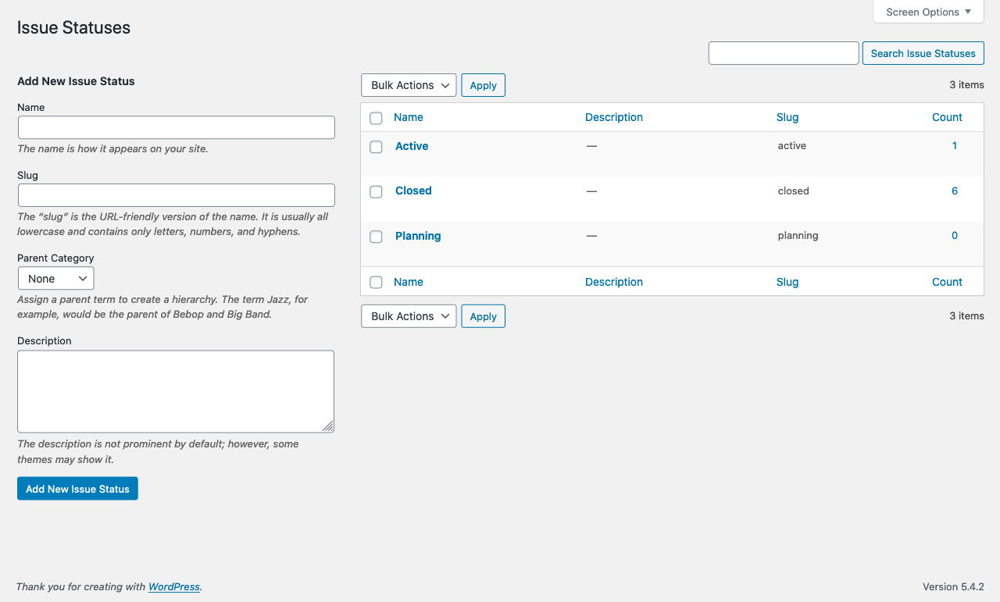

# 

> Optimize publication workflows by using WordPress as your print CMS.

[](#support-level) [](https://github.com/10up/eight-day-week/actions/workflows/cypress.yml) [](https://github.com/10up/eight-day-week/releases/latest)  [](https://github.com/10up/eight-day-week/blob/develop/LICENSE.md)

## Table of Contents
* [Overview](#overview)
* [Features](#features)
* [Requirements](#requirements)
* [Installation](#installation)
* [Filters & Hooks](#filters--hooks)
* [Screenshots](#screenshots)
* [Known Caveats/Issues](#known-caveatsissues)
* [Changelog](#changelog)
* [Contributing](#contributing)

## Overview

Eight Day Week provides a set of tools to manage your print workflow directly in your WordPress dashboard–right where your posts are!  Primarily, it offers an interface to group, label, and manage the workflow status of posts in a printed "Issue".


## Features

### Create "Print Issues"

- Add and order sections, and articles within sections
- Assign article statuses specific to your print workflow


### Limit access to Print Roles

Two custom roles are added by this plugin to best model a real-world print team.

- The Print Editor role offers full access to the creation interfaces, such as Print Issue, Article Status, Print Publication, etc.
- The Print Production role offers read-only access to a Print Issues. The XML export tool is also available to Production users.


### View a Print Issue in "Read Only" mode

- Circumvents the post locking feature by offering a read-only view of a print issue


### XML Export to InDesign

- Export XML files specifically formatted for import into InDesign


Issue Statuses | Publications | Article Statuses
------------- | ----------------- | ------------
[](.wordpress-org/screenshot-4.png) | [](.wordpress-org/screenshot-5.png) | [](.wordpress-org/screenshot-6.png)

## Requirements

* PHP 7.4+
* [WordPress](http://wordpress.org) 5.7+

## Installation

Eight Day Week has no settings or configurations to set up. It just works!

## Filters & Hooks
Eight Day Week provides a number of filters and hooks for customizing and extending the plugin.

### Modules

Eight Day Week follows a module-style approach to many of its features. These can be turned on or off via filters, and all work independently.
These are:
Article Byline
Article Count
Article Export
Article Status
Issue Publication
Issue Status
Any of these can be disabled by returning a falsey value from the following filter format:
`add_filter( 'Eight_Day_Week\Plugins\load_$plugin', '__return_false' );`
The `$plugin` value is a slug version of the plugin name, i.e. article-byline.

### Article Table

The information displayed in the list of articles within a Print Issue is filterable. Custom columns can be added via the following filters: `Eight_Day_Week\Articles\article_columns` and `Eight_Day_Week\Articles\article_meta_$column_name`.

Sample usage:

	add_filter( 'Eight_Day_Week\Articles\article_columns', function( $columns ) {
	    $columns['byline'] = _x( 'Byline', 'Label for multiple, comma separated authors', 'your-text-domain' );
	    return $columns;
	} );
	add_filter( 'Eight_Day_Week\Articles\article_meta_byline', function( $incoming_value, $post ) {
	    return implode( ', ', wp_list_pluck( my_get_post_authors_function( $post ), 'display_name' ) );
	}

### Print Issue Table

The information displayed in the list of Print Issues is filterable. Custom columns can be added via the following filter:
`Eight_Day_Week\Print_Issue_Columns\pi_columns`.  Note that this is a convenience filter, the base filter is `manage_edit-print-issue_columns`.  See `includes/functions/print-issue-columns.php` for sample usage.

### Article Export

The export of posts in a Print Issue is highly customizeable, from the file name of the zip, to the file name of the individual files, to the contents of the files themselves.  The best reference would be to read through `includes/functions/plugins/article-export.php`.  [Here's](https://github.com/10up/eight-day-week/wiki/Sample-Eight-Day-Week-filters-for-the-Observer) a few examples used on the *Observer*.

### Sample Eight Day Week filters for the Observer

Examples from Observer's eight-day-week-filters.php:

```php
<?php

add_filter( 'Eight_Day_Week\Plugins\Article_Export\xml_outer_elements', function( $elements, $article ) {
	$elements['subHeadline'] = get_post_meta( $article->ID, 'nyo_dek', true );
	return $elements;
}, 10, 2 );

add_filter( 'Eight_Day_Week\Plugins\Article_Export\xml_outer_elements', function( $elements, $article ) {
	if( function_exists( '\Eight_Day_Week\Plugins\Article_Byline\get_article_byline' ) ) {
		$elements['byline']      = \Eight_Day_Week\Plugins\Article_Byline\get_article_byline( $article );
	}
	return $elements;
}, 10, 2 );

add_filter( 'Eight_Day_Week\Plugins\Article_Export\xpath_extract', function( $extract ) {
	$extract[] = [
		'tag_name'  => 'pullQuote',
		'container' => 'pullQuotes',
		'query'     => '//p[contains(@class, "pullquote")]'
	];
	return $extract;
} );

add_filter( 'Eight_Day_Week\Plugins\Article_Export\dom', function ( $dom ) {
	$swap_tag_name = 'emphasized';

	$extract_map = [
		'strong' => [
			'solo'  => 'bold',
			'inner' => 'em'
		],
		'em'     => [
			'solo'  => 'italics',
			'inner' => 'strong'
		],
	];

	foreach ( $extract_map as $tag_name => $map ) {
		$nodes  = $dom->getElementsByTagName( $tag_name );
		$length = $nodes->length;

		for ( $i = $length; -- $i >= 0; ) {
			$el         = $nodes->item( $i );
			$emphasized = $el->getElementsByTagName( $map['inner'] );
			if ( $emphasized->length ) {
				$em            = $dom->createElement( $swap_tag_name );
				$em->nodeValue = $el->nodeValue;
				try {
					$el->parentNode->replaceChild( $em, $el );
				} catch ( \Exception $e ) {

				}
				continue;
			}

			$new            = $dom->createElement( $map['solo'] );
			$new->nodeValue = $el->nodeValue;
			try {
				$el->parentNode->replaceChild( $new, $el );
			} catch ( \Exception $e ) {

			}

		}

	}

	return $dom;

} );
```

## Known Caveats/Issues

### Gutenberg exports

Gutenberg-based exports include some additional metadata/details that a Classic Editor-based export does not.  [Gutenberg stores block data in HTML comments](https://developer.wordpress.org/block-editor/key-concepts/#delimiters-and-parsing-expression-grammar), so you'll notice those comments (in the form of `<!-- "Gutenberg block data" -->`) appearing in the Eight Day Week XML export.  Note that the XML is still valid--you can test and confirm that yourself using an [XML validator](https://www.xmlvalidation.com/)--though depending on your version of InDesign you may get different results upon importing a Gutenberg export compared to a Classic Editor export.  Our testing showed that those HTML comments in a Gutenberg export did not affect the import into InDesign however.  You can test how this works in your version of InDesign with these sample XML files: [Gutenberg XML](https://raw.githubusercontent.com/wiki/10up/eight-day-week/BlockEditor-sample.xml), [Classic Editor XML](https://raw.githubusercontent.com/wiki/10up/eight-day-week/ClassicEditor-sample.xml).  You can also test how this works with full ZIP exports of Print Issues containing a [Block Editor sample](https://raw.githubusercontent.com/wiki/10up/eight-day-week/BlockEditor-SampleExport.zip) or a [Classic Editor sample](https://raw.githubusercontent.com/wiki/10up/eight-day-week/ClassicEditor-SampleExport.zip).

## Support Level

**Stable:** 10up is not planning to develop any new features for this, but will still respond to bug reports and security concerns. We welcome PRs, but any that include new features should be small and easy to integrate and should not include breaking changes. We otherwise intend to keep this tested up to the most recent version of WordPress.

## Changelog

A complete listing of all notable changes to Eight Day Week are documented in [CHANGELOG.md](https://github.com/10up/eight-day-week/blob/develop/CHANGELOG.md).

## Contributing

Please read [CODE_OF_CONDUCT.md](https://github.com/10up/eight-day-week/blob/develop/CODE_OF_CONDUCT.md) for details on our code of conduct, [CONTRIBUTING.md](https://github.com/10up/eight-day-week/blob/develop/CONTRIBUTING.md) for details on the process for submitting pull requests to us, and [CREDITS.md](https://github.com/10up/eight-day-week/blob/develop/CREDITS.md) for a listing of contributors to Eight Day Week.

## Like what you see?

<a href="http://10up.com/contact/"></a>
